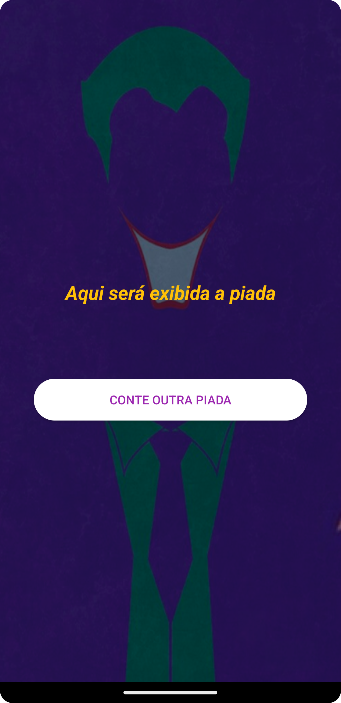
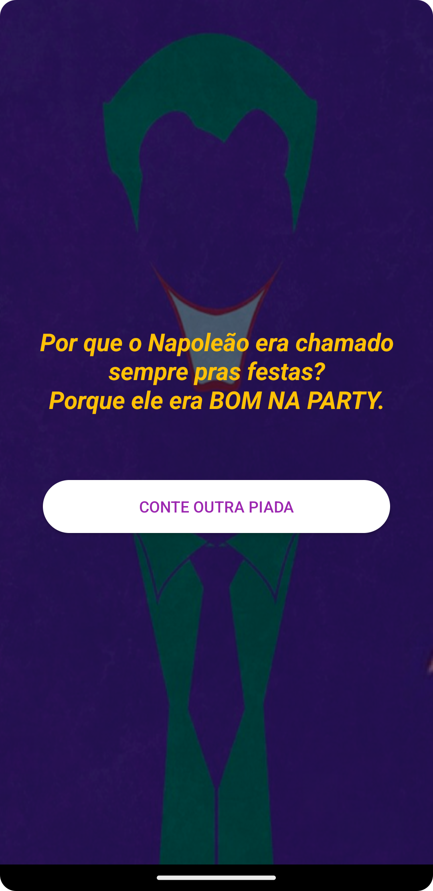

# Appiadas

## Esse é o primeiro App feito em Kotlin no meu MBA em Mobile developmente na FIAP.

  
  

### O aplicativo é bem simples, você aperta o botão e ele conta uma piada, alé de ter um efeito sonoro de bateria após a piada ser exibida.
